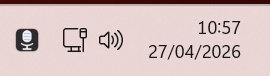
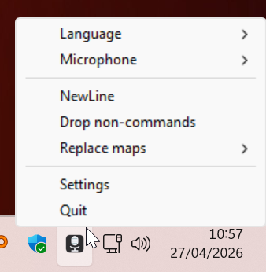
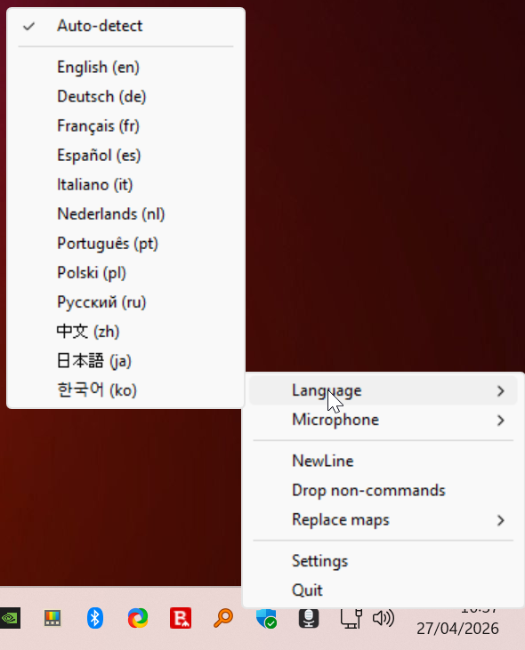
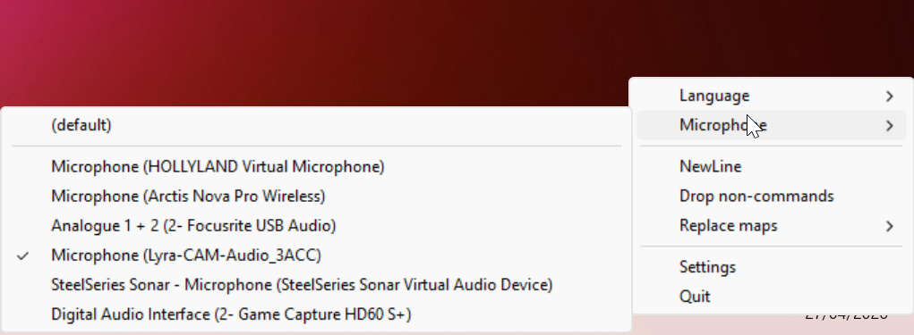
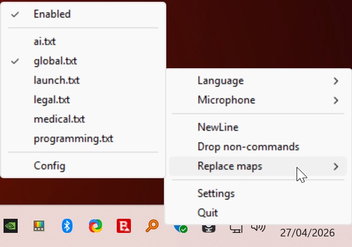
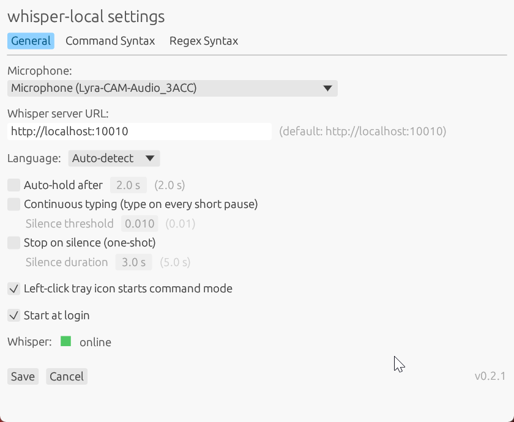
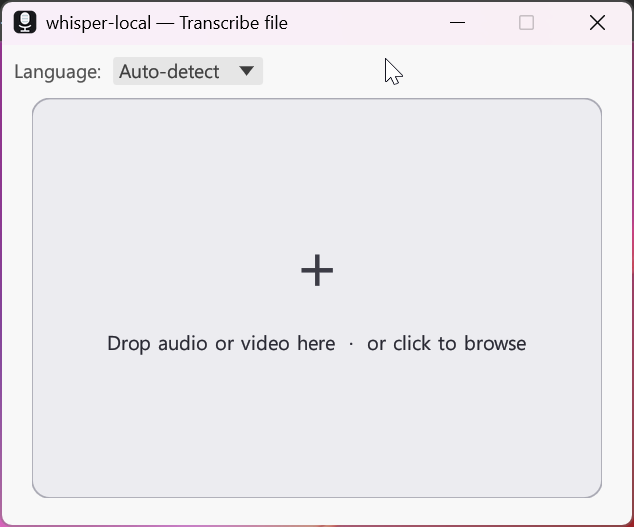

<h1 align="center">whisper-local</h1>

<p align="center"><strong>Hold a key. Speak. Release. It types.</strong></p>

<p align="center">
  Lightweight • Private • Local. A Windows tray app that turns your microphone into a keyboard
  in any application, talking to a Whisper server you run yourself in Docker or WSL2.
  Audio never leaves your machine.
</p>

<p align="center">
  
  
  
  
  
</p>

<p align="center">
  
  
  
  
  
</p>

```
Ctrl+Win  hold to record       →  release, transcript types into the focused app
Ctrl+Win  double-tap           →  latched mode; tap again to stop
left-click tray icon           →  toggle listen mode (command-mode loop)
double-click tray icon         →  drag-and-drop file transcriber
right-click tray icon          →  microphone, language, replace maps, settings
```

<p align="center">
  
</p>

<p align="center">
  
</p>

### Recording modes *(checkboxes in Settings + tray)*

| mode | behaviour |
|---|---|
| **Auto-hold after** `[2.0 s]` | Hold `Ctrl+Win` this long → app keeps recording on its own. Tap `Ctrl+Win` again to stop. |
| **Continuous typing** | Silence-segmented loop. After every ~0.6 s pause the chunk is typed, mic restarts automatically. Silent chunks are skipped. `Ctrl+Win` exits the loop. |
| **Stop on silence** | One-shot. After `[5.0 s]` of silence (editable) recording ends and the transcript is typed. |
| **Drop non-commands** | Command mode. Only transcripts that match a replace-map rule fire an action; everything else is dropped. |
| **NewLine** | Press Enter after every transcript. Toggle in tray or Settings. |
| **Listen mode** (left-click tray) | Turns Continuous typing + Drop non-commands on together and latches the mic. Click again to stop. Pressing `Ctrl+Win` mid-listen pauses it for one dictation and restores it afterwards. |

Shared silence threshold `[0.01]` (mic RMS below counts as silence).

<p align="center">
  
  &nbsp;
  
</p>

### Replace maps

Voice-triggered actions live in `%APPDATA%\whisper-local\replace_maps\*.txt`.
Each line is `trigger:replacement`. `#` starts a comment. Triggers match the
whole chunk case-insensitive; trailing `.!?,;:` is stripped.

| value prefix | effect |
|---|---|
| *(none)* | type the value as text (supports `\n`, `\t`, `\\` escapes) |
| `!cmd args` | run shell command via `cmd /c` (fire-and-forget) |
| `>>https://url` | POST current selection, replace it with the response body |
| `>>local:NAME` | apply built-in transform to selection: `lower`, `upper`, `trim`, `reverse`, `md5`, `sha256` |
| `>>exec:cmd args` | pipe the current selection into `cmd` as stdin, type stdout back over the selection |
| `>>cmd:cmd args` | run `cmd` with no stdin, type stdout at the caret (use with regex captures for voice-prompt commands) |
| `^chord[,chord ...]` | send key sequence (`ctrl+a`, `home,shift+end,delete`, …) |
| `/pattern/flags` | regex trigger (`i`, `m`, `s`, `x`). Whole-chunk match (`/^...$/`) expands captures into the value, then treats it as an action — enabling parameterised commands. |

Six maps ship as templates and can be toggled per-domain in the tray:
**global · launch · programming · medical · legal · ai**.

<p align="center">
  
</p>

The `ai` map
contains ready-to-use triggers for **Claude CLI, OpenAI, OpenRouter,
Ollama, LM Studio, vLLM, and llama.cpp** — both inline PowerShell
oneliners and matching helper scripts (`.ps1` and `.py`, stdlib-only)
shipped to `%APPDATA%\whisper-local\helpers\`.

Built-in voice commands press Enter without needing a rule:
`new line`, `newline`, `enter`, `return`, `neue zeile`, `zeilenumbruch`, `absatz`.

Examples:

```
my email:email@example.com
my signature:--\nName\nemail@example.com

/\bclode\b/i:Claude
/^google for (.+)$/i:!start "" "https://www.google.com/search?q=$1"

open browser:!start chrome
open settings:^win+i

lowercase selected:>>local:lower
md5 selected:>>local:md5
fix grammar:>>https://api.example.com/grammar

# voice-prompt AI: speak the trigger + your question, answer types at the caret
/^ask claude (.+)$/i:>>cmd:powershell -NoProfile -Command "'$1' | claude -p --allowedTools 'Read,Edit,Bash' -"
/^ask ollama (.+)$/i:>>cmd:powershell -NoProfile -Command "$b=@{model='llama3';stream=$false;messages=@(@{role='user';content='$1'})}|ConvertTo-Json -Depth 8 -Compress; (Invoke-RestMethod -Uri 'http://localhost:11434/api/chat' -Method Post -ContentType 'application/json' -Body ([Text.Encoding]::UTF8.GetBytes($b))).message.content"

# rewrite selection with an AI: select text, say the trigger, answer replaces selection
ask gpt:>>exec:powershell -NoProfile -File "%APPDATA%\whisper-local\helpers\openai.ps1"
fix grammar:>>exec:powershell -NoProfile -File "%APPDATA%\whisper-local\helpers\openrouter.ps1" -Model "anthropic/claude-3.5-sonnet"
```

Full reference: [SYNTAX-README.md](SYNTAX-README.md).
The Settings window also has **Command Syntax** and **Regex Syntax** tabs.

---

## ✨ Key features

<table align="center">
<tr>
<td align="center" width="20%" valign="top">
<h3>🎙️ Push-to-talk</h3>
Hold <code>Ctrl+Win</code>, speak, release.<br>
Transcript types into the focused window via <code>SendInput</code>.<br>
Latched mode for hands-free.
</td>
<td align="center" width="20%" valign="top">
<h3>🔒 Local-only</h3>
Audio never leaves your machine.<br>
Talks to <strong>your</strong> Whisper server on <code>localhost</code>.<br>
No accounts, no telemetry, no rate limits.
</td>
<td align="center" width="20%" valign="top">
<h3>📂 File drop</h3>
Drag any audio or video file onto a small window.<br>
Save as <code>.txt</code> or copy to clipboard.<br>
ffmpeg-supported formats.
</td>
<td align="center" width="20%" valign="top">
<h3>🌍 Multilingual</h3>
Auto-detect or pin an ISO code.<br>
English, Deutsch, 中文, 日本語, 한국어, … render correctly with system fonts.
</td>
<td align="center" width="20%" valign="top">
<h3>👥 Speakers</h3>
Optional diarization.<br>
Auto / Exactly N / Pitch-based.<br>
Per-speaker copy + save once detected.
</td>
</tr>
</table>

---

## 🤔 Why local-first

Most voice-to-text products ship your microphone to a server farm and your transcripts to a database
you can't see. Some go further and screenshot your active window for "context." That's an unusual
permission model for something you talk to all day.

`whisper-local` goes the other way:

- **Your audio never leaves your machine.** It's a `localhost` POST to a Whisper server you started.
- **No telemetry. No accounts. No rate limits. No subscription.**
- **No screen capture. No clipboard sniffing. No background context-gathering.** It records when you hold the hotkey and shuts up when you release it.
- **Tiny footprint.** A single ~10 MB tray binary. Mainstream cloud dictation tools ship as 500+ MB Electron apps that idle in the background; this is one process with one job.
- **You own the model.** Swap `faster-whisper-large-v3-turbo` for any OpenAI-compatible Whisper server you trust.

If your machine is offline, it still works — as long as your Whisper server is reachable on `localhost`.

---

## 🚀 Quick start

1. Run a local Whisper server on `http://localhost:10010` (Docker / WSL2). Tested with **faster-whisper-large-v3-turbo**.
2. Download the latest `whisper-local.exe` from [Releases](../../releases) (or build from source — see below).
3. Run it. Tray icon appears.
4. Right-click the tray → **Settings** → set Whisper URL, microphone, language.
5. Hold **Ctrl+Win** anywhere → speak → release. Transcript types into whatever window has focus.
6. Double-click the tray → drag any audio / video file onto the small window for offline file transcription.

<p align="center">
  
  &nbsp;
  
</p>

---

## 📦 Requirements

- **Windows 11**
- A locally running **Whisper HTTP server** exposing OpenAI-compatible endpoints:
  - `POST /v1/audio/transcriptions` (multipart audio file in)
  - `GET  /health`
- Default target: `http://localhost:10010`. Configurable in Settings.
- Tested against **faster-whisper-large-v3-turbo** running in Docker on the same machine, and the same model running in WSL2 with CUDA.

That's it. No login. No cloud account. No paid tier.

---

## 🔨 Build

```bash
cargo build --release                                                    # full
cargo build --release --no-default-features --features transcribe-file   # min
```

| build | binary | idle RAM | overlay | drop window | speakers | Settings UI |
|-------|--------|----------|---------|-------------|----------|-------------|
| **full** | 10 MB | ~380 MB | ✓ | ✓ | ✓ | ✓ |
| **min**  | 10 MB | ~15 MB  | — | ✓ | — | ✓ |

Min skips the always-on overlay child process — that drops idle RAM from ~380 MB to ~15 MB. Open the file-drop window only when you need it (a transient ~250 MB while it's on screen, then back to 15 MB).

---

## 🗂️ Config

`%APPDATA%\whisper-local\config.toml` — auto-created with sane defaults. Edit it directly or use the Settings window.

## 📓 Log

`%APPDATA%\whisper-local\log.txt` — rotated at 1 MB. `WHISPER_DEBUG=1` for verbose output.

---

## ⚖️ License

MIT.
